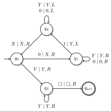

# LaTeX

## How to typeset := correctly

```latex
\documentclass{standalone}
\usepackage{mathtools}
\begin{document}
\( b := 10 \) \emph{versus} \( b \coloneqq 10 \).
\end{document}
```

## How to make set complement

```latex
\overline{L}
```

## Use PSTRicks instead of tikz for automata

```latex
\usepackage{pstricks,pst-node,pst-tree}
```

When using together with Pandoc, make sure to compile it using `pandoc --pdf-engine=xelatex ...`.

## Lightning symbol

```latex
\usepackage{stmaryrd}

$\lightning$
```

Can then be used in math-mode.

## Write something on top of equal sign

```latex
$\stackrel{sometext}{=}$
```

If `def` is not available in math-mode, then use `\text{sometext}`.

## Insert checkmark arrow

```latex
\usepackage{amssymb}

\checkmark
```

## Specify correct hyphenation

```latex
\hyphenation{Transitions-tabelle}
```

## Add margin to block of text

```latex
\usepackage{scrextend}

\begin{addmargin}[1em]{2em}% 1em left, 2em right
...
\end{addmargin}
```

## Fancy headers

```latex
\usepackage{fancyhdr}
\pagestyle{fancy}
```

## Enumeration with roman letters

```tex
\usepackage{enumerate}

\begin{enumerate}[i.]
  \item One
  \item Two
  \item Three
\end{enumerate}
```

Use `[I.]` for capitalized roman letters.

## Linebreak inside big sum

```tex
\usepackage{amsmath}

\sum_{\substack{i \in S \\ i \in T}} i
```

## Enclose align with {}

```tex
\left\{
  \begin{align}
    1 \\ 2 \\ 3
  \end{align}
\right\}
```

## Tikz Automata as single SVG

```tex
\documentclass[crop,border=1pt]{standalone}
\usepackage{amsmath}
\usepackage{amssymb}
\usepackage{tikz}
\usetikzlibrary{arrows,automata,positioning,decorations,shadows}

\begin{document}
  \begin{tikzpicture}[
      initial text={}
      , node distance=3cm
      , on grid
      , auto
      , every state/.style = {draw=black,fill=white,thick,drop shadow={fill=black!40}}
      , every initial by arrow/.style = {font=\large,thick,-stealth}
    ]
    \node[state,initial]    (q_0)                      {$q_0$};
    \node[state]            (q_2) [above right of=q_0] {$q_2$};
    \node[state]            (q_1) [below right of=q_2] {$q_1$};
    \node[state]            (q_3) [below right of=q_0] {$q_3$};
    \node[state,accepting]  (q_4) [right of=q_3]       {$q_{acc}$};

    \path[->,thick] (q_0) edge              node        {$Y \mid Y, R$} (q_3);
    \path[->,thick] (q_3) edge [loop below] node        {$Y \mid Y, R$} (q_3);
    \path[->,thick] (q_3) edge              node        {$\square \mid \square, R$} (q_4);
    \path[->,thick] (q_0) edge              node        {$0 \mid X, R$} (q_1);
    \path[->,thick] (q_1) edge [loop right] node        {$\begin{matrix}Y \mid Y, R \\ 0 \mid 0, R\end{matrix}$} (q_1);
    \path[->,thick] (q_1) edge              node[right] {$1 \mid Y, L$} (q_2);
    \path[->,thick] (q_2) edge [loop above] node        {$\begin{matrix}Y \mid Y, L \\ 0 \mid 0, L\end{matrix}$} (q_2);
    \path[->,thick] (q_2) edge              node[left]  {$X \mid X, R$} (q_0);
  \end{tikzpicture}
\end{document}
```

```bash
$ pdflatex TM.tex
$ pdf2svg TM.tex TM.svg
```

Result:


